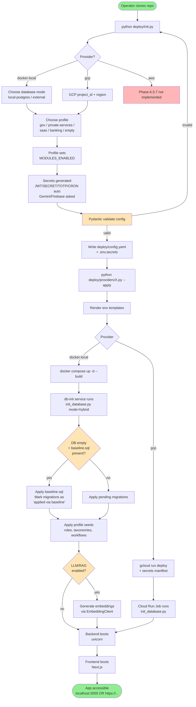
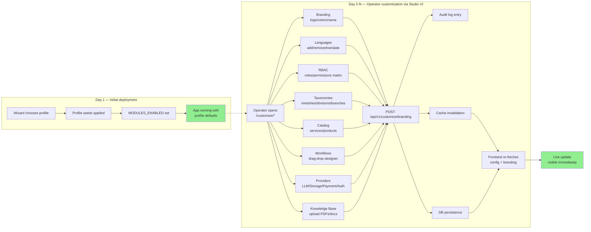
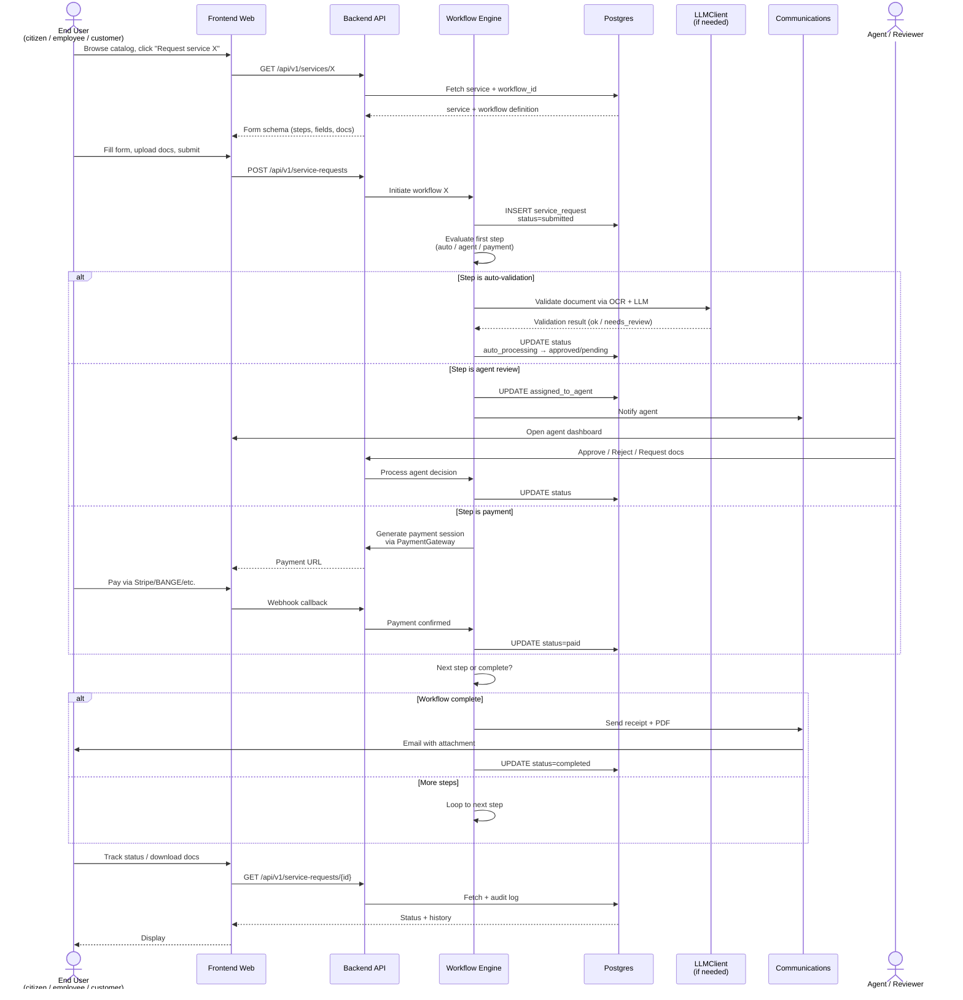
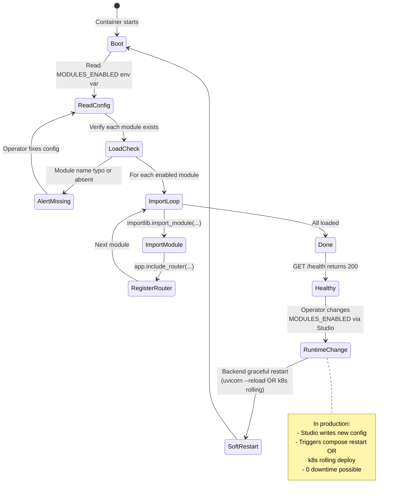
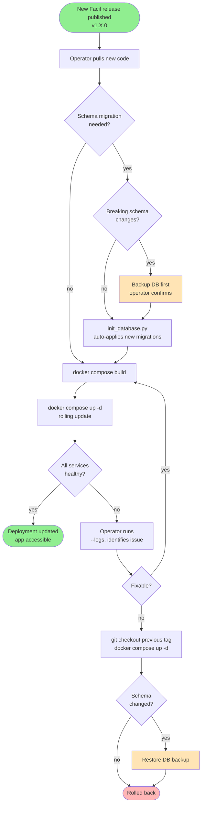
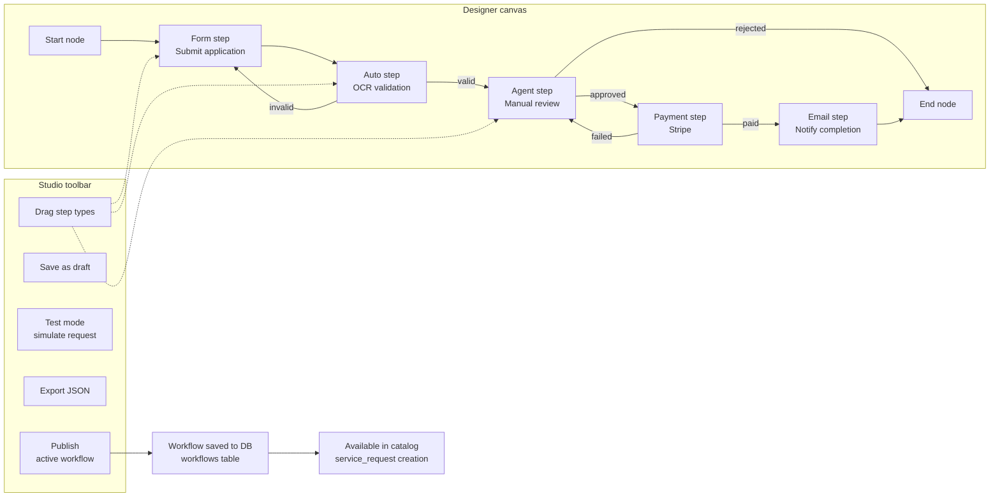

# Facil Framework — BPMN (Business Process Model & Notation)

> Diagrammes Mermaid pour rendre les processus du framework explicites.
> Tous les diagrams ci-dessous sont rendus nativement par GitHub.

---

## Vue d'ensemble — 5 processus clés

1. **Déploiement** : du clone repo à l'app fonctionnelle
2. **Customization** : du profile au runtime customisé
3. **Workflow execution** (runtime) : exécution d'un workflow utilisateur
4. **Module activation** : changement modules actifs sans rebuild
5. **Migration** : mise à jour d'un déploiement (nouveau release)

---

## 1. Déploiement (du clone à l'app fonctionnelle)

**Légende** :
- 🟢 Start/End
- 🟡 Décisions
- 🔴 Phase non implémentée

---

## 2. Customization (du profile au runtime)

---

## 3. Workflow execution (runtime, exécuté par un user)

---

## 4. Module activation (changement modules sans rebuild)

---

## 5. Migration (mise à jour d'un déploiement)

---

## 6. Bonus — Customization Studio Workflow Designer (drag-drop)

---

## Notes pour les agents IA & devs

Ces BPMN servent **3 audiences** :

1. **Devs Voie B** : comprendre l'architecture cible avant de coder
2. **Agents IA marketing** : générer du content explicatif (vidéos, blog posts)
3. **Operators / clients potentiels** : comprendre comment Facil fonctionne sans creuser le code

Si vous éditez un diagramme : tester le rendu Mermaid sur <https://mermaid.live> avant commit.

Format BPMN 2.0 strict (XML) **non utilisé** ici car :
- Mermaid est lisible et versionnable
- Rendu GitHub natif (pas besoin d'outil externe)
- Pas de complex orchestration enterprise nécessaire au niveau doc

Si Phase H Workflow Designer adopte BPMN 2.0 XML pour les workflows utilisateurs runtime, ce sera dans le format propre du `Workflows table` (DB), pas dans cette doc.
