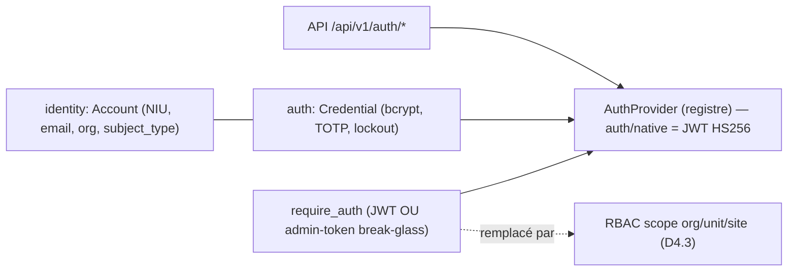
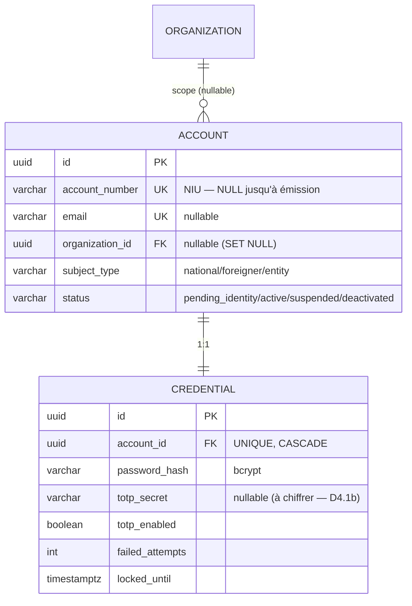
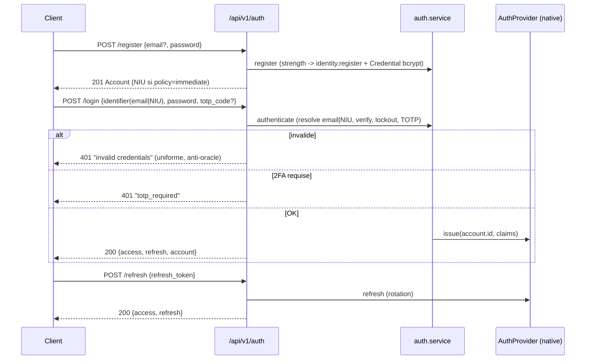

# Auth & Identité (Phase D4)

> **Statut** : D4.0 (Resend) · D4.1 (identité + NIU) · D4.2 (auth) **implémentés**.
> D4.1b (identité vérifiée / extraction) **préparé, différé**. D4.3 (RBAC) **à venir**.
> Plan interne : `.claude/plans/PHASE_D4_AUTH_RBAC_PLAN.md`. Légende legacy :
> mémoire `reference_legacy_auth_rbac_map`.

## 1. Vue d'ensemble

Trois briques distinctes, découplées :

- **Identité** (`app/identity/`) — *qui* est le compte : `Account` + `account_number`
  (NIU générique) + `organization_id` (multi-tenant) + `subject_type`.
- **Auth** (`app/auth/` + provider `auth/native`) — *comment* il le prouve :
  `Credential` (password bcrypt + TOTP), JWT access/refresh, lockout.
- **RBAC** (à venir, D4.3) — *ce qu'il a le droit de faire*, scopé org→unit→site.

## 2. Modèle de données (implémenté)

Migrations : `0004_create_account`, `0005_create_credential`.

## 3. NIU (account_number) — identifiant générique

- **Numérique pur** par défaut : `[préfixe-catégorie] + corps ALÉATOIRE (anti-énumération)
  + 2 chiffres ISO 7064 Mod 97,10` (détecte toutes les erreurs 1 chiffre + transpositions).
- **Catégorie** (national/étranger/entité) = **préfixe** (fixé à l'émission, distinguable)
  **+** `subject_type` (attribut faisant autorité, évolue à la naturalisation).
- **Émission configurable** (`identity.issuance_policy`) :
  - `immediate` (défaut framework) — NIU émis à l'inscription.
  - `on_verified_document` (gov/banking) — NIU émis **après vérification d'une pièce** (D4.1b).
- **Sécurité** : `UNIQUE` en base ; **immutable** (`AlreadyIssued`) ; check-digit validé
  **avant tout accès BD** ; aléatoire = anti-énumération ; zéro PII encodée ; mint atomique
  (UNIQUE + SAVEPOINT retry). Stratégie verrouillée au deploy (changer ⇒ nouveaux comptes only).
- **Lié** à la pièce (D4.1b) de façon **relationnelle** (FK + blind-index UNIQUE), jamais
  *dérivé* du numéro de document (préserve immutabilité, multi-docs, privacy).

## 4. Flux d'authentification (implémenté)

Endpoints : `POST /api/v1/auth/{register, login, refresh, logout, 2fa/setup, 2fa/enable}`.
Garde : `require_auth` = Bearer JWT **OU** `X-Admin-Token` (break-glass, pont jusqu'à D4.3/D4.4).
Secret JWT = `JWT_SECRET` (généré par `ensure_secrets`, rendu dans l'env backend).

## 5. Détails de sécurité

- **Anti-énumération** : login par email/NIU → **401 uniforme** (compte existant ou non) ;
  check-digit NIU validé avant lookup.
- **Lockout** : 5 échecs → verrou 15 min (`failed_attempts` / `locked_until`).
- **2FA** : TOTP (pyotp), issuer = `branding.app_name` (configurable, dé-couplé du legacy).
- **Passwords** : bcrypt (72 octets safe), policy min 8 + maj/min/chiffre.

## 5b. Durcissement auth (D4.5/D4.6 — livré)

- **Sessions + refresh rotation** (`session`) : chaque refresh **supersede** l'ancien jeton
  (statut `rotated`) et en émet un neuf ; réutilisation d'un jeton **`rotated`** = **vol
  détecté** → révocation de **toutes** les sessions ; un jeton `revoked`/`expired` (logout,
  kick single-session, idle) est juste refusé (ne nuke pas la session active). `/logout`
  (single + all-devices) révoque réellement.
- **Timeouts (D4.11)** : **idle glissant** (pas de refresh dans la fenêtre → session
  déconnectée) — **agents 30 min**, utilisateurs natifs **1 h** (par `subject_type`,
  configurable, 0=off) + deadline **absolue** (`expires_at`). À l'expiration le `/refresh`
  renvoie **401** (« session expired — re-authenticate ») → le frontend (D5) **redirige vers
  le login** (pas d'erreur opaque).
- **Single-session (D4.11)** : un compte **agent** = **un seul device** (un nouveau login
  révoque les autres) ; flag global `auth_single_session` pour forcer aussi les autres.
- **TOTP chiffré at-rest** (AES-256-GCM, `app/security/crypto.py`, clé `TOTP_ENCRYPTION_KEY`
  → fallback `JWT_SECRET_KEY`) + **backup codes** à usage unique (hachés SHA-256).
- **Reset mot de passe** + **vérification email** : token opaque haute entropie, **haché**
  en base, **TTL** + **usage unique** (`auth_token`) ; reset révoque les sessions ;
  réponses **uniformes** (anti-énumération) ; envoi best-effort via le provider email.
- **Audit** (`auth_audit`) : login / login_failed / logout / password_reset /
  email_verified / two_factor_enabled (+ ip / user-agent / détail), jamais bloquant.
- **OIDC (D4.6)** : `KeycloakOIDCProvider.verify()` valide les jetons IdP (JWKS **RS256**,
  issuer + audience) ; `require_auth` essaie une **chaîne de vérificateurs** (native +
  OIDC selon `auth.methods`). L'**émission** OIDC appartient à l'IdP (flux auth-code,
  arrive avec le frontend D5 + le realm Keycloak P11) — `issue/refresh` y lèvent NotImplemented.
- **Fédération (D4.7)** : Keycloak fédère **LDAP/AD** et brokerise **SAML** en amont →
  on ne voit que de l'**OIDC** (zéro code LDAP/SAML chez nous). Un jeton OIDC est **résolu
  vers un `account` LOCAL** (`federated_identity(provider, subject)` UNIQUE — clé immuable,
  **jamais** l'email ; repli par email **vérifié** sur un compte pré-provisionné ; sinon
  JIT-create `subject_type='agent'`) AVANT tout check RBAC, donc le **scope local s'applique
  inchangé**. **L'autorisation reste 100% locale** — les permissions par module ne sont
  **jamais** mappées depuis l'IdP. Automatisation : mapping **groupe→rôle** (`auth.oidc.role_map`)
  re-synchronisé à chaque login (`account_role.source='idp'`), rôles `source='local'`
  préservés ; offboarding (retrait de groupe AD/Keycloak) → rôle `idp` retiré au login suivant ;
  compte suspendu/inactif → refus. Cible d'échelle : SCIM 2.0 (déprovision push) — plus tard.
- **Pro / automatisé (D4.9-D4.10)** : **OIDC Discovery** — un seul `auth.oidc.issuer`,
  `jwks_uri`+endpoints auto-dérivés de `.well-known/openid-configuration` (tout IdP OIDC :
  Keycloak/Okta/Azure/Auth0). **Révocation IdP** : `POST /api/v1/auth/oidc/backchannel-logout`
  (vérifie le `logout_token` signé → révoque la `sid`). **Provisioning realm automatisé +
  idempotent** : `deploy/scripts/provision_keycloak.py` (realm + client + **client-scope
  partagé** `facil-contract` portant les mappers `groups`/`org` + taxonomie de groupes) —
  l'opérateur ajoute users/LDAP/IdP upstream. **Break-glass durci** (expiry/IP-allowlist/disable/log).
  **Introspection RFC 7662 (D4.11)** : opt-in (`auth.oidc.introspection` + client confidentiel) —
  sur cache-miss, vérifie que le jeton est encore **actif** à l'IdP (offboarding quasi-instantané,
  ≤ TTL cache) ; fail-open sur erreur transitoire (back-channel logout + statut local = autres filets).
- **Échelle 1M+ (D4.12)** : état de sécurité partagé via `app/core/cache.py` (ABC `Cache` :
  `MemoryCache` / `RedisCache`, `build_cache(REDIS_URL)`) — **révocation OIDC, rate-limit et
  federation cache deviennent GLOBAUX multi-réplica** (Redis) au lieu de per-pod. Dégradation
  in-process si Redis absent.
- **SCIM 2.0 (D4.13)** : `/scim/v2/Users` (bearer `SCIM_TOKEN`) — pré-provisioning +
  **deprovision PUSH instantané** (`active=false` → compte désactivé + sessions révoquées),
  `externalId` → `federated_identity` (un login OIDC ultérieur retombe sur le compte
  pré-provisionné). Standard IGA (Okta/Azure/SailPoint). Groups→rôles = suite.

## 6. D4.1b — identité vérifiée (PRÉPARÉ, DIFFÉRÉ)

Les hooks identité existent (policy `on_verified_document`, `issue_number(category)`,
`subject_type`). **Non activé/obligatoire** tant que l'**agent d'extraction LLM multimodal**
et les **liaisons BD externes** de vérification ne sont pas prêts (éviter le bâclage).
À implémenter le moment venu : table `identity_document` (doc chiffré AES-GCM + **blind-index
HMAC UNIQUE** = 1 pièce/1 compte, port `verified_identifiers` legacy) → extraction +
score de confiance + gate → `issue_number(category)`.

## 7. RBAC (D4.3 — livré)

Voir [`AUTH_RBAC.md`](AUTH_RBAC.md) : `role` / `permission` / `account_role` avec **scope
`{organization_id, org_unit_id, site_id}`** (sous-arbre via `org_unit.path`),
`require_permission(perm)` **scope par défaut**, rôles seedés **par profil YAML**,
permissions **déclarées par module**. Enforce sur organization/location.
