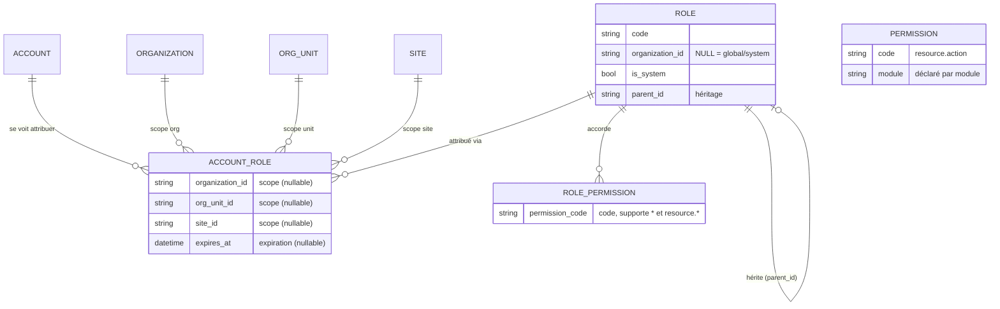
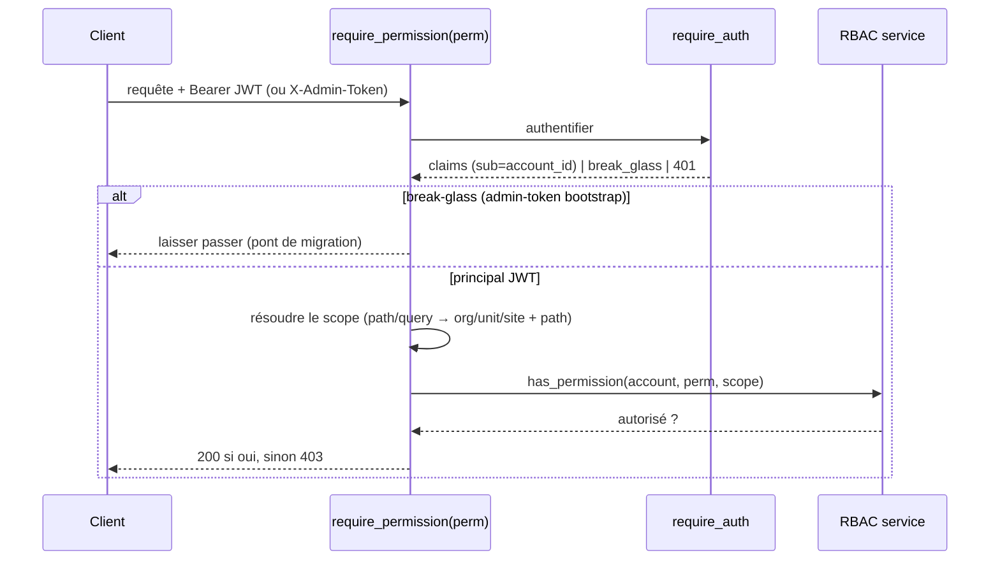

# RBAC — contrôle d'accès générique, scope-aware (D4.3)

Couche d'autorisation **cœur** (always-on, sœur de `identity`/`auth`). Corrige les
quatre défauts du legacy : scope ignoré par défaut, mono-tenant, rôles gov
hardcodés, admin global non-scopable. Décisions structurantes : voir le plan
interne `PHASE_D4_AUTH_RBAC_PLAN.md`.

## Modèle de données



- **Role** : faisceau de permissions. `organization_id` NULL = rôle global/système
  disponible pour tous les tenants ; sinon rôle possédé par une organisation.
  `parent_id` = héritage simple (un rôle hérite des permissions de ses ancêtres).
- **Permission** : catalogue des codes `resource.action`, **déclarés par module**
  (`app.modules.<nom>.permissions:PERMISSIONS`) + permissions cœur (`rbac.*`).
- **RolePermission** : les **codes** accordés (string), donc `*` (tout) et
  `resource.*` (joker ressource) fonctionnent sans ligne de catalogue.
- **AccountRole** : l'attribution **scopée** — un compte porte un rôle dans un
  scope `{organization_id?, org_unit_id?, site_id?}` avec expiration optionnelle.
  Les NULL **élargissent** (pas d'org = global ; pas d'unité = toute l'org ; pas
  de site = tout le sous-arbre de l'unité).

## Couverture de scope

Une attribution couvre une requête si elle en est une région **ancêtre-ou-égale**
dans la hiérarchie org → unit → site :

```text
covers(attribution, requête) ⟺
   (attribution.org est NULL          OU  requête.org == attribution.org)
ET (attribution.unit est NULL         OU  requête.unit_path ⊆ attribution.unit_path)
ET (attribution.site est NULL         OU  requête.site == attribution.site)
```

Le sous-arbre d'unité utilise le **path matérialisé** d'`org_unit`
(`requête.unit_path.startswith(attribution.unit_path)`). Conséquences voulues :

- une attribution **plus étroite** que la requête ne couvre pas (un grant au niveau
  unité n'autorise pas une action au niveau org) ;
- un grant scopé à une org **n'autorise pas** une action globale (lister toutes les
  orgs, créer une org) — ces actions exigent un grant global.

**Fail-closed** : sans aucune attribution couvrante (rôle actif, non expiré), c'est
`403`.

## Match de permission

`organization.read` est autorisé si l'ensemble des grants contient le code exact,
le joker global `*`, ou le joker ressource `organization.*`. Les grants effectifs
d'un rôle = ses propres codes **+** ceux de ses ancêtres (`parent_id`, garde
anti-cycle).

## Taxonomie de verbes (`app/rbac/verbs.py`)

Vocabulaire canonique imposé par convention pour que chaque module déclare ses
permissions `<ressource>.<verbe>` de façon cohérente :

`read · create · update · delete · manage · approve · export · print · assign`

`manage` est le super-verbe (accordé via le joker `<ressource>.*`). Un module ne
déclare que les verbes qu'il utilise (org/location : read/create/update/delete/export).
Les grants sont **validés contre le catalogue** (un code inconnu hors `*`/`resource.*`
est rejeté — fini les fautes de frappe silencieuses).

## Listes scopées (pas de 403 global)

Les `GET` de liste (`/organization/`, `/location/sites`) sont **filtrés par scope** :
ils renvoient ce que le principal peut lire (liste vide si rien), au lieu de
`403`-er un utilisateur scopé-org sur la liste globale. Granularité **org** (un
filtrage unit/site plus fin viendra avec les besoins).

## Protections & audit

- Les rôles **`is_system`** (seedés par profil) sont **protégés** : suppression /
  ré-attribution de permissions via l'API → `409` (ils appartiennent au seeder).
- L'API ne crée **jamais** de rôle `is_system` (réservé au seeder).
- Les attributions enregistrent **`created_by`** (qui a attribué) — piste d'audit.

## Flux d'enforcement



Le scope de requête est résolu **sans coût pour le caller** : `org_id`/
`organization_id` → org ; `unit_id`/`org_unit_id` → unité (→ org + path) ;
`site_id` → site (→ org/unité/path). Les créations dont la cible est dans le **corps**
(ex. créer un site) résolvent le scope depuis le payload et enforce **en handler**.

### Break-glass (bootstrap)

Le **token admin** (require_auth → `break_glass=True`) contourne RBAC : c'est le
pont qui permet au premier opérateur de créer orgs/comptes et d'attribuer des
rôles **avant** qu'aucun grant n'existe. À retirer une fois les rôles administratifs
attribués.

## Rôles seedés par profil (pas de SQL hardcodé)

Les rôles globaux sont seedés depuis des YAML **par profil**
(`app/rbac/seeds/<profil>.yaml`, 1:1 avec `deploy/scripts/profiles.py`) par un
seeder **idempotent** : au boot (gaté par la config `profile`) et via
`POST /api/v1/rbac/admin/reseed`. Le seed synchronise aussi le **catalogue de
permissions** (cœur + tous les modules). Les codes de rôles sont **génériques**
(`admin`, `member`, `manager`, `supervisor`, `agent`, `tenant_admin`,
`branch_manager`, `teller`…) — l'opérateur les **attribue** au bon scope ; aucun
poste métier n'est figé dans le code (corrige les 47 rôles gov hardcodés du legacy).

## API

| Méthode | Route | Permission |
|---|---|---|
| `GET` | `/api/v1/rbac/permissions` | `rbac.read` |
| `GET` | `/api/v1/rbac/roles` | `rbac.read` |
| `POST` | `/api/v1/rbac/roles` | `rbac.manage` |
| `PUT` | `/api/v1/rbac/roles/{role_id}/permissions` | `rbac.manage` |
| `DELETE` | `/api/v1/rbac/roles/{role_id}` | `rbac.manage` |
| `GET` | `/api/v1/rbac/accounts/{account_id}/roles` | `rbac.read` |
| `POST` | `/api/v1/rbac/accounts/{account_id}/roles` | `rbac.manage` |
| `DELETE` | `/api/v1/rbac/accounts/{account_id}/roles/{assignment_id}` | `rbac.manage` |
| `POST` | `/api/v1/rbac/admin/reseed` | `rbac.manage` |

Les modules `organization` et `location` sont **enforced** : chaque route exige
`organization.{read,create,update,delete}` ou `location.{read,create,update,delete}`,
le scope étant résolu depuis la requête.

## Montée en charge

`has_permission` = lecture des attributions + permissions du compte (indexées :
`account_role.account_id`, `role.parent_id`). Un cache (type Redis 10 min, comme le
legacy) est une **optimisation différée**, volontairement pas implémentée
prématurément.

## Hors scope

UI de gestion des rôles (**D5**) ; providers auth externes réels
(keycloak/OIDC) ; `verified_identifiers`.
