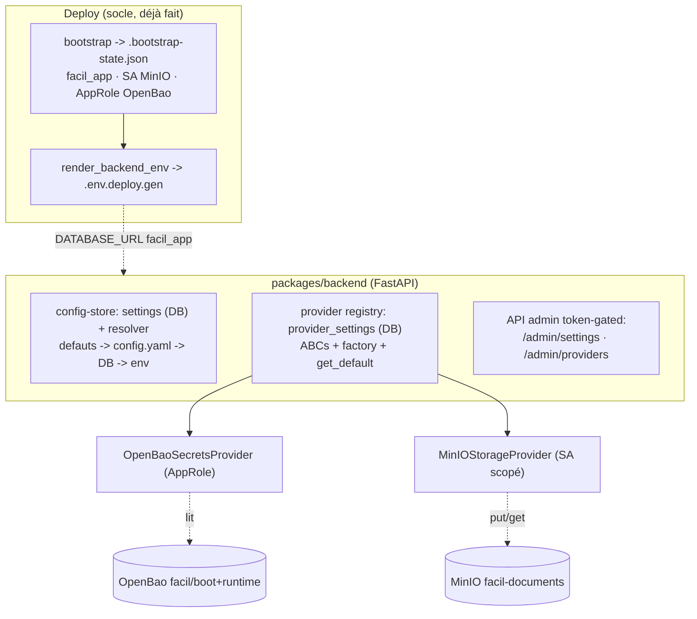

# Fondation backend — config-store + registre de providers (Phase D : D1 / D1.5 / D2)

> **Statut** : implémenté + validé live (2026-06-12). `packages/backend/`.
> **Plan** : `.claude/plans/PHASE_D_APP_FOUNDATION_PLAN.md` (interne).
> **Pré-requis** : socle data-plane provisionné (voir `DATAPLANE_BOOTSTRAP.md`).

## 1. Vue d'ensemble

Le tier applicatif démarre sur le data-plane souverain durci, autour de **deux
mécanismes dynamiques** :

1. **Config-store BD** — configuration applicative éditable à chaud par l'admin
   (étage DB), au-dessus des défauts/fichier/env.
2. **Registre de providers** — chaque capacité (secrets, storage, LLM, email,
   auth, payment) est un provider pluggable, sélectionnable et configurable au
   runtime.

Le backend est un **skeleton minimal neuf** (clean-slate ADR-0004), PAS un port
du legacy : il porte uniquement la fondation. Les 32 modules métier et les 150
tables legacy ne sont **pas** touchés (portage incrémental ultérieur).



## 2. Structure (`packages/backend/app/`)

| Module | Rôle |
|---|---|
| `config.py` | Pydantic `BaseSettings` (env/.env) — bootstrap config (DATABASE_URL, ADMIN_TOKEN) ; normalise vers `postgresql+asyncpg://` |
| `db/{base,engine}.py` | `DeclarativeBase` + type JSON portable (JSONB/SQLite) ; engine async + session factory |
| `models/setting.py` | table `settings` (généralise `system_rules`) |
| `models/provider.py` | table `provider_settings` (généralise `communication_provider_settings`) |
| `config_store/{resolver,repository}.py` | résolveur en couches + CRUD settings |
| `core/providers/{base,registry,repository}.py` | ABCs + `ProviderRegistry` + CRUD provider_settings |
| `core/module_registry.py` | Module Loader (A.5) : `MODULES_ENABLED` → include conditionnel `app.modules.<name>.api:router` |
| `core/providers/{secrets_env,secrets_openbao,storage_minio}.py` | providers concrets |
| `security/admin_token.py` | garde token bootstrap (`X-Admin-Token`, fail-closed) |
| `api/{admin_settings,admin_providers,deps}.py` | routes admin |
| `main.py` | app + `/health` + lifespan (engine, resolver, registry) |
| `alembic/` | migrations (0001 settings, 0002 provider_settings) |

## 3. Config-store (étage DB éditable admin)

- Table **`settings`** : `key`, `value` (jsonb), `value_type`, `scope`,
  `secret_ref`, noms i18n, dates d'effet, `is_active`, audit.
- **Résolveur** (`config_store/resolver.py`) : précédence
  **env > DB > config.yaml > défauts**. L'app-config sans env → la **DB gagne**
  (éditable admin) ; l'infra-config a un env → l'**env gagne** (non runtime).
- **API** `/api/v1/admin/settings/` (CRUD, token-gated) ; un PUT/DELETE
  **rafraîchit** la couche DB du résolveur en mémoire (invalidation D1 ;
  fan-out EventBus/NOTIFY = ultérieur).

## 4. Registre de providers

- Table **`provider_settings`** : `capability`, `provider_code`, `config` (jsonb),
  `secret_ref`, `is_default`, `is_active`, rate/retry/timeout. Unicité (capability,
  provider_code).
- **ABCs** (`core/providers/base.py`) : `SecretsProvider`, `StorageProvider`,
  `LLMProvider`, `EmailProvider` + `healthcheck()`. Le métier dépend des
  interfaces, jamais d'un SDK vendeur.
- **`ProviderRegistry`** : `register(cap, code, factory)`, `build(cap, code, config)`,
  `get_default(cap, session)` (lit `is_default` en DB). Factories **lazy** (rien ne
  se connecte au build).
- **API** `/api/v1/admin/providers/` : CRUD + `POST .../{cap}/{code}/default`
  (un seul défaut/capacité) + `GET .../registered` + `POST .../{cap}/{code}/check`
  (healthcheck réel).

### Providers concrets (souverains, validés live)
- **`secrets/openbao`** : login **AppRole** (creds de l'env rendu) → lit kv-v2
  `facil/boot` + `facil/runtime` → `get_secret(name)`.
- **`storage/minio`** : S3 **put/get/delete** via le **SA scopé** (boto3 path-style,
  `asyncio.to_thread`).
- **`secrets/env`** : lit l'environnement (défaut dev).
- **`llm/ollama`** : inférence souveraine locale (`/api/chat` + `/api/embed` +
  `/api/tags` healthcheck). Modèle = service séparé profil `ai`, poids en volume,
  jamais dans l'image (ADR-0002).
- **`llm/openai_compat`** : tout endpoint OpenAI-compatible (vLLM, Docker Model
  Runner, API managée) ; clé Bearer injectée par le routeur (jamais en config jsonb).
- **`email/smtp`** : `smtplib` (stdlib) enveloppé `asyncio.to_thread` (patron MinIO,
  zéro dépendance ajoutée) ; STARTTLS optionnel ; mot de passe injecté (jamais en jsonb).
  Validé live contre `smtp4dev` (profil `mail`).
- **`email/sendgrid`** : API v3 (`/mail/send` + `/scopes` healthcheck) httpx pur ;
  clé API injectée (fallback env).

### Routing LLM par rôle (W6)

`LLMRouter` (exposé `app.state.llm_router`) lit `ai.routing` (rôle → nom) et
`ai.providers` (nom → `{kind, endpoint, model, api_key_secret}`) du config-store ;
`get_for_role(role, session)` construit le provider et résout `api_key_secret`
via le `SecretsProvider` (`resolve_secret`, fallback env). Défauts **split souverain**
(cf. mémoire stack IA) : `public_chat → gemma4:e4b` · `agent_backend → gemma4:12b`
(+ fallback API managée) · `embedding → embeddinggemma`. La topologie physique est
un knob (prod = services séparés ; dev contraint = un seul service Ollama).
Admin : `GET /api/v1/admin/providers/llm/routing` + `POST .../llm/routing/check`.

### Module Loader (D3, Phase A.5)

`core/module_registry.py` — `load_modules(app, enabled, package="app.modules")`
inclut **uniquement** les routers des modules listés dans `MODULES_ENABLED`
(rendu depuis `modules.enabled` W6). Convention : un module = package
`app.modules.<name>` exposant `api:router` (`APIRouter`) ; layout cible
`api/ models/ services/ handlers/`. Deux modes d'échec distincts (réalité du
portage incrémental) : un module **absent** (profil le liste mais pas encore
porté) → **WARN + skip** (le backend démarre quand même) ; un module **présent
mais cassé** (pas d'`api` / pas de `router`) → **`ModuleLoadError`** au boot (vrai
bug). Les routers **cœur** (`admin_settings`, `admin_providers`) restent inclus
explicitement (ce ne sont pas des modules métier).

Premier vrai module livré : **`system`** (`/api/v1/modules/system/info` —
branding + version + modules enabled/available ; consommé par l'installeur D5),
**OFF par défaut**, sert aussi de **template de référence**. Le chemin de prod est
testé en réel (chargement du vrai `app.modules.system`) ; les cas d'échec via des
packages-fixtures (`tests/sample_modules/`).

## 5. Jonction deploy↔app (D1.5)

`docker_local --apply` est **staged** :
1. data-plane up → 2. **bootstrap** (mint facil_app/SA/AppRole → state) →
3. **`render_backend_env`** (state → `.env.deploy.gen` : `DATABASE_URL` facil_app,
   `MINIO_*`, `OPENBAO_*`) → 4. **db-init** = `alembic upgrade head` (superuser) +
   **backend** (facil_app). Frontend **profile-gaté** (`web`, OFF jusqu'à D5).

> **Migrations = superuser `facil`** (DDL) ; **backend = `facil_app`** (least-priv,
> DML). `facil_app` reçoit les grants via `ALTER DEFAULT PRIVILEGES` du bootstrap.

## 6. Accès & tutoriel

> Python : `C:\facil_framework\.venv\Scripts\python.exe`. Garde admin : `ADMIN_TOKEN`
> (généré par `ensure_secrets` dans `.env.secrets`).

```powershell
# Stack complète (data-plane + bootstrap + backend), frontend OFF :
python deploy/providers/docker_local.py --config=deploy/config.yaml --apply
# -> backend healthy http://localhost:8080/health

# Settings (config runtime)
curl -H "X-Admin-Token: $TOKEN" http://localhost:8080/api/v1/admin/settings/
curl -X PUT -H "X-Admin-Token: $TOKEN" -H "Content-Type: application/json" \
  -d '{"value":"sendgrid","scope":"email"}' \
  http://localhost:8080/api/v1/admin/settings/email.provider

# Providers (registre)
curl -H "X-Admin-Token: $TOKEN" http://localhost:8080/api/v1/admin/providers/registered
curl -X POST -H "X-Admin-Token: $TOKEN" \
  http://localhost:8080/api/v1/admin/providers/secrets/openbao/check
```

**Ajouter un provider** = (1) classe qui implémente l'ABC de sa capacité,
(2) `registry.register(cap, code, factory)` dans `default_registry()`,
(3) éventuel `provider_settings` (config) via l'API admin. Le métier ne change pas.

### Gotchas
- `asyncpg` depuis le host Windows → port publié 5432 échoue (Docker Desktop) ;
  backend/alembic tournent **dans le réseau compose** (`postgres:5432`).
- Apply depuis un worktree → projet compose distinct (conflit de ports) ;
  utiliser `COMPOSE_PROJECT_NAME=facil_framework` ou nettoyer les orphelins.

## 7. Statut & limites (honnête)

- ✅ **Fait + live** : config-store, résolveur, registre, providers OpenBao secrets
  & MinIO storage, **LLM Ollama + openai_compat + routing par rôle** (validé live
  contre un vrai Ollama), **email SMTP + Sendgrid** (SMTP validé live contre smtp4dev),
  jonction `docker_local --apply`, Alembic.
- ✅ **D3 Module Loader** : `MODULES_ENABLED` → include conditionnel (skip-si-absent
  / fail-si-cassé) ; rendu depuis `cfg.modules.enabled` (W6) dans l'env backend.
- ✅ **Modules de base `organization` + `location`** (CRUD + hiérarchie + scope-site,
  Alembic `0003`) — **validés LIVE** end-to-end (org → unité → site → branche via l'API
  admin sur la stack réelle). Détail : `MODULES_ORG_LOCATION.md`.
- ⏳ **À venir** : provider auth — réel mais lié à **D4** (remplace la garde token) ;
  **D5** frontend (panneau admin + installeur web) ; payment au portage du module
  (brancher `GatewayServiceBase` legacy BANGE/MTN/Orange).
- Le legacy (150 tables, 32 modules) reste parqué — portage incrémental.
