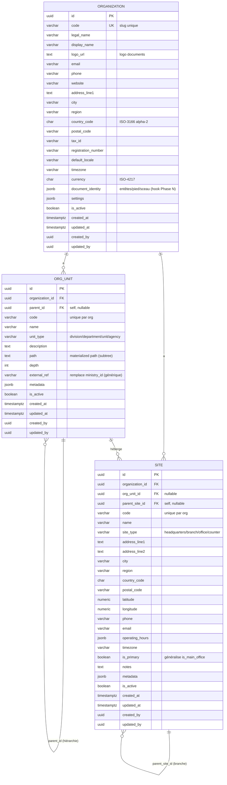
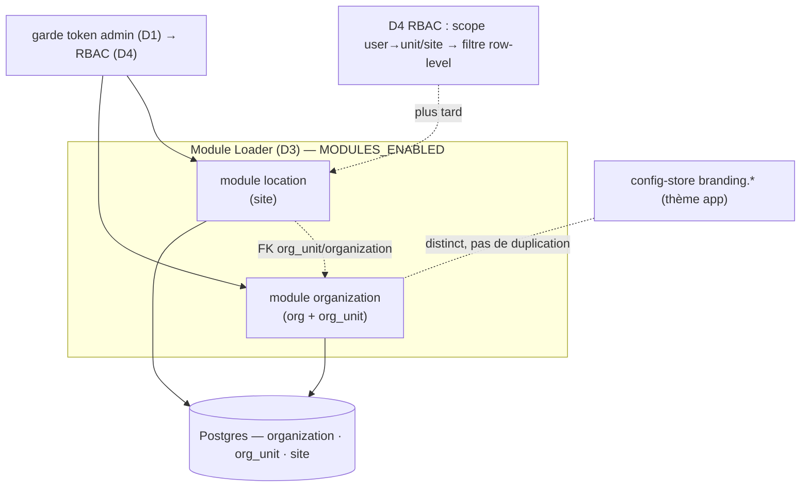

# Modules de base — `organization` + `location`

> **Statut** : CONCEPTION (2026-06-13), en attente de validation avant implémentation.
> **Phase** : premiers vrais modules métier du backend neuf (après D3 Module Loader).
> **Décision** : `organization` + `location` génériques, optimisés multi-branches +
> scope-site ; le **branding-thème reste dans le config-store** (pas de duplication).
> **Auth** : token-gate admin maintenant ; RBAC réel branché en D4 (sans refonte).

## 1. Périmètre & frontières (anti-duplication)

Trois préoccupations **distinctes**, trois homes :

| Préoccupation | Home | Nature |
|---|---|---|
| **Thème de l'app** (nom court, couleurs, logo UI, locales, support) | **config-store** `branding.*` | clé-valeur, runtime-éditable, lu par le résolveur / l'UI |
| **Identité de l'entité métier** (raison sociale, logo documents, contacts, IDs fiscaux, entêtes PDF) | module **`organization`** | relationnel, multi-entité, utilisé sur les documents officiels |
| **Structure physique** (sites, branches, bureaux, emplacements) | module **`location`** | relationnel, hiérarchique, support du **scope-site** |

> **Règle de frontière** : le config-store décrit *comment le logiciel se présente* ;
> `organization` décrit *qui est l'entité cliente*. Un portail peut afficher un thème
> « Facil » en UI tout en émettant des documents sous « Ministerio de X » — logos et
> noms sont donc légitimement séparés.

## 2. Modèle de domaine

Hiérarchie générique (généralise le legacy `entities` / `entity_locations` / `cities`,
dé-hardcodée des spécificités gov : `ministry_id`, `entity_type=treasury`, régions
`Insular/Continental`, `workflow_codes`) :

```text
Organization (entité cliente / tenant — 1 par défaut, N en SaaS)
   └── OrgUnit (sous-entité : division / département / agence — hiérarchique, self-FK)
          └── Site (emplacement physique : siège / branche / bureau / guichet — hiérarchique)
```



## 3. Schéma BD (générique, multi-branches)

Types portables (Postgres prod / SQLite tests) via le `JSON` portable et `String`
SQLAlchemy ; `uuid` = `String(36)` côté SQLite. Audit commun :
`created_at/updated_at/created_by/updated_by`.

### `organization`

- PK `id`. **UK `code`**. `legal_name` NOT NULL.
- Identité : `display_name`, `logo_url`, `email`, `phone`, `website`.
- Adresse siège : `address_line1/2`, `city`, `region`, `country_code` (ISO-2),
  `postal_code`.
- Légal/fiscal : `tax_id`, `registration_number`.
- Défauts : `default_locale`, `timezone`, `currency` (ISO-3).
- `document_identity` jsonb (letterhead/footer/seal — consommé par Phase N).
- `settings` jsonb (extensibilité sans migration). `is_active`.
- **Index** : `unique(code)` ; partiel `where is_active`.

### `org_unit`

- PK `id`. FK `organization_id` → `organization` (ON DELETE CASCADE).
- FK self `parent_id` → `org_unit` (hiérarchie, nullable).
- `code` NOT NULL, `name` NOT NULL, `unit_type` (défaut `department`, **non
  enum-verrouillé** : validé contre un set configurable).
- `path` (materialized path `/uuid/uuid/…`) + `depth` → requêtes **sous-arbre**
  rapides (toutes les unités sous X) sans récursion.
- `external_ref` (remplace `ministry_id` — lien externe générique), `metadata` jsonb.
- **Contraintes** : `unique(organization_id, code)` ; index `(organization_id,
  parent_id)`, index `path`.

### `site`

- PK `id`. FK `organization_id` → `organization` (CASCADE).
- FK `org_unit_id` → `org_unit` (nullable : un site peut appartenir à une unité).
- FK self `parent_site_id` → `site` (branche sous un site principal).
- `code` NOT NULL, `name` NOT NULL, `site_type` (défaut `branch`).
- Adresse : `address_line1/2`, `city`, `region`, `country_code`, `postal_code`,
  `latitude`/`longitude` (numeric).
- Contact : `phone`, `email`. `operating_hours` jsonb (forme legacy `DayHours`).
- `timezone`, `is_primary` (généralise `is_main_office`), `notes`, `metadata`.
- **Contraintes** : `unique(organization_id, code)` ; index `(organization_id,
  org_unit_id)`, `(organization_id, parent_site_id)`. Geo-index = ultérieur.

## 4. Multi-branches & scope-site (optimisation)

Le **scope** est le mécanisme par lequel données et permissions se limitent à une
branche/un site. Stratégie :

1. **Row-level scope** : chaque enregistrement métier *site-scopé* (porté par les
   futurs modules) portera `organization_id` + `org_unit_id?`/`site_id?`. Le legacy
   le faisait déjà (`field_inspections.entity_id` + `entity_location_id`).
2. **Sous-arbre via `path`** : « tout ce qui est sous l'unité X » = `WHERE path LIKE
   'X/%'` (indexé), pas de récursion. Idem branches via `parent_site_id`.
3. **Helpers du module** : `org_unit.subtree(id)`, `site.accessible(scope)` —
   consommés par l'enforcement RBAC en **D4** (le scope vient de l'utilisateur
   authentifié). Aujourd'hui (token-gate) : structures + helpers présents, **pas de
   filtre par utilisateur**.



## 5. Architecture module (layering)

Convention établie par ces 1ers modules (template `app/modules/<name>/`) :

```text
app/modules/organization/
    __init__.py
    api/__init__.py          # router (entrypoint Module Loader) — routes admin token-gated
    schemas.py               # Pydantic (Create/Update/Response) — validation
    models.py                # SQLAlchemy (Base partagé → Alembic central)
    repository.py            # accès données async (pas d'ORM lourd, requêtes ciblées)
    service.py               # logique métier (codes uniques, path, scope helpers)
app/modules/location/
    …idem (Site), dépend de organization via FK
```

- **Migrations** : modèles importent le `Base` partagé (`app/db/base.py`) → **Alembic
  central autogenerate** (chaîne `0003_org_location`). Pas de migrations par-module
  (cohérent avec D1/D2 ; 1 DB, monolithe modulaire ADR-0001).
- **Découplage import** : les modèles doivent être importés par Alembic (env.py)
  même si le module est OFF, sinon `autogenerate` les rate. → Alembic `env.py`
  importe explicitement `app.modules.*.models` (les tables existent en base même
  module désactivé ; seul le *router* est conditionnel). À acter (cf. risque R1).

## 6. Surface API (token-gated, préfixe module)

- `organization` : `GET/POST/PUT /api/v1/modules/organization/` (+ `/{id}`),
  `GET /api/v1/modules/organization/units` (arbre), CRUD unités.
- `location` : `GET/POST/PUT/DELETE /api/v1/modules/location/sites` (+ `/{id}`),
  filtres `?organization_id=&org_unit_id=&parent_site_id=`, `GET …/sites/{id}/branches`.

## 7. Décision — complétude du branding config-store (auto-challenge)

**Verdict** : oui, le `branding.*` actuel (`app_name`, `primary_color`, `logo_url`)
est **incomplet pour un thème d'app**. Je le complète — **strictement thème/coquille**,
jamais identité métier (qui va dans `organization`). Set cible config-store :

| Clé | Rôle |
|---|---|
| `branding.app_name` *(existe)* | nom court produit (chrome UI) |
| `branding.tagline` | slogan/sous-titre |
| `branding.logo_url` *(existe)* | logo principal (fond clair) |
| `branding.logo_dark_url` | logo fond sombre |
| `branding.favicon_url` | icône onglet |
| `branding.login_background_url` | hero auth/landing |
| `branding.primary_color` *(existe)* | couleur principale |
| `branding.secondary_color` | accent |
| `branding.theme_mode` | `light`/`dark`/`auto` défaut |
| `branding.default_locale` | langue UI défaut (`es`/`fr`/`en`) |
| `branding.supported_locales` | liste activée |
| `branding.support_email` | contact support (UI) |
| `branding.support_url` | lien aide/support |

**Hors config-store** (→ `organization`) : raison sociale, IDs fiscaux, adresse
postale, logo/letterhead documents, contacts de l'entité, sites. Implémentation =
étendre `_DEFAULTS` (main.py) + `BrandingConfig` (deploy) + surfacer dans l'installeur
D5. Pas de table : ça reste clé-valeur dans `settings`.

## 8. Génériques retirés du legacy (ne pas réintroduire)

- `ministry_id` → `external_ref` générique.
- `entity_type=treasury`, défaut gov → `unit_type` libre/configurable.
- régions `Insular/Continental` codées en dur → `region` texte + `country_code` ISO.
- `workflow_codes` sur l'entité → couplage workflow déporté (link-table au portage du
  module workflow, pas dans le socle org).

## 9. Risques

| # | Risque | Mitigation |
|---|---|---|
| R1 | Alembic rate les tables si le module est OFF | `env.py` importe `app.modules.*.models` inconditionnellement ; seul le router est conditionnel |
| R2 | Couplage gov réintroduit | revue : champs génériques only ; specifics → `metadata`/`external_ref` |
| R3 | Hiérarchie coûteuse à grande échelle | materialized `path` + index ; éviter récursion |
| R4 | Permissions absentes (token-gate) | scope helpers prêts ; enforcement câblé en D4 |
| R5 | SQLite tests vs PG (uuid, jsonb) | types portables (`JSON`, `String(36)`) déjà éprouvés en D1/D2 |
