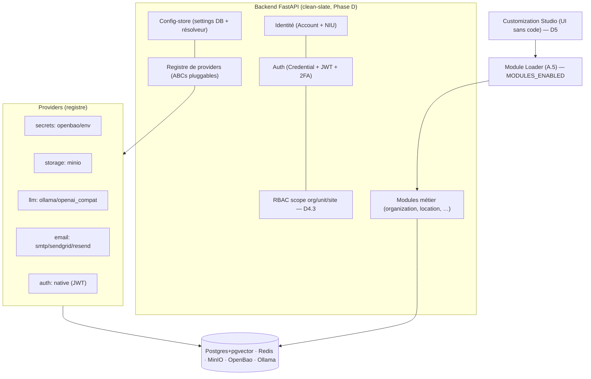

# Architecture — index par domaine

Documentation d'architecture de **Facil Framework**, organisée par domaine. Chaque
doc contient les schémas (Mermaid) de ce qui est **réellement implémenté**. Les
décisions structurantes sont dans les **ADR** (`docs/adr/`).

## Vue système (cible)



## Domaines

| Domaine | Doc | Contenu |
|---|---|---|
| **Fondation backend** | [`BACKEND_FOUNDATION.md`](BACKEND_FOUNDATION.md) | config-store, résolveur en couches, registre de providers, Module Loader, jonction deploy↔app |
| **Modules métier** | [`MODULES_ORG_LOCATION.md`](MODULES_ORG_LOCATION.md) | `organization` (entité + unités hiérarchiques) + `location` (sites/branches), scope-site, schéma BD |
| **Auth & Identité** | [`AUTH_IDENTITY.md`](AUTH_IDENTITY.md) | Account + NIU, Credential, JWT/2FA, sessions+rotation, reset/vérif email, idle/single-session, OIDC verify/discovery, fédération, SCIM, cache Redis |
| **RBAC (autorisation)** | [`AUTH_RBAC.md`](AUTH_RBAC.md) | rôles/permissions, scope org/unit/site, couverture, seeds par profil, enforcement |
| **Déploiement on-prem** | [`PHASE_0_DEPLOYMENT_BACKBONE.md`](PHASE_0_DEPLOYMENT_BACKBONE.md) · [`DATAPLANE_BOOTSTRAP.md`](DATAPLANE_BOOTSTRAP.md) · [`DEPLOYMENT_WIZARD.md`](DEPLOYMENT_WIZARD.md) | backbone, provisioning data-plane, wizard de config |
| **Socle / contexte** | [`SOCLE_GE.md`](SOCLE_GE.md) | socle de référence (origine TaxasGE) |

## ADR (décisions)

`docs/adr/0001…0008` : monolithe modulaire · inférence pluggable (Ollama→vLLM) ·
secrets (OpenBao+SOPS) · strangler · storage (MinIO) · k3s+PKI · chiffrement at-rest
(LUKS+OpenBao) · **edge WAF + microsegmentation réseau**.

## Conventions

- **Build prod = CI** (GitHub Actions → GHCR). Local Docker = dev/test uniquement.
- Docs Markdown **lint-clean** (CI bloquante : `markdownlint-cli2`). Schémas en
  ```mermaid``` ; pas d'URL nue (MD034) ; langue sur les blocs de code (MD040).
- Les **plans internes** (par phase, avec checklists) sont dans `.claude/plans/`
  (gitignored) ; ces docs-ci sont la vue **produit** stabilisée.
