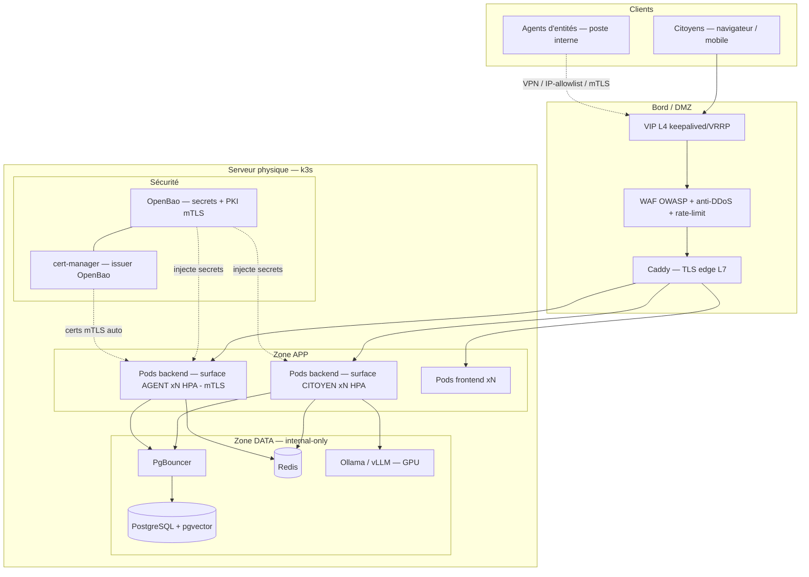

# Socle d'architecture — Déploiement souverain Guinée Équatoriale

> Document de référence · Date : 2026-06-11 · Statut : proposition experte, à valider
> Portée : justification des choix d'architecture, **dimensionnement des serveurs physiques pour la Guinée Équatoriale**, procédures de montée en charge, topologie de déploiement et d'interconnexion.
> Plans liés : `INFRA_HYBRID_DEPLOY_PLAN.md` (P0→P13), `PHASE_P7_P8_SECRETS_PKI.md`, `PHASE_0_FOUNDATION_CHECKLIST.md`.

> ⚠️ **Honnêteté méthodologique** : les chiffres de dimensionnement ci-dessous sont des **estimations d'ingénierie fondées sur des hypothèses explicites** (population, taux d'adoption, concurrence). Ils ne remplacent pas un **audit de dimensionnement réel** (tests de charge k6/Locust sur l'image cible) à mener en P10. Toute hypothèse est signalée par 🔸.

---

## 1. Principe directeur

**Un déployeur installe sur UN serveur physique souverain aujourd'hui, et doit pouvoir absorber la croissance sans réécriture.** Le socle est conçu pour que la bascule mono-nœud → multi-nœud soit un **ajout de machines** (`kubectl join`), pas une migration de plateforme.

Trois invariants :
1. **Mêmes images** partout (dev, on-prem, cloud) — seul le packaging (compose vs Helm) et les overrides changent.
2. **Application stateless 12-factor** — tout l'état est externalisé (PostgreSQL, Redis). Une instance ou cent instances exécutent le même code.
3. **Souveraineté** — aucune donnée sensible ne sort de l'infrastructure (LLM local, secrets locaux, PKI locale).

---

## 2. Choix d'architecture justifiés

| Choix | Décision | Pourquoi (justification) | Alternative écartée |
|------|----------|--------------------------|---------------------|
| **Application** | Monolithe modulaire, 1 DB, modules activés par profil | Intègre l'intégrité transactionnelle critique (lock-ordering bundle, 100+ agents concurrents) impossible à garantir proprement en microservices sans sagas fragiles. Moins de runtime/RAM/pools DB. | Microservices (complexité ops + transactions distribuées) |
| **Surfaces** | 2 surfaces (citoyen public / agent intranet) = 2 déploiements de la **même image** | Défense en profondeur : compromettre la surface publique n'expose pas les routes agents. | Une seule surface (surface d'attaque agrégée) |
| **Orchestration on-prem** | **k3s mono-nœud** (ADR-0006) | k8s certifié CNCF, léger (single-binary), **mêmes charts Helm** que le cluster → continuité d'échelle sans réécriture. Donne « k8s sur serveur local » souverain. | `docker-compose.prod` (cul-de-sac : passage cluster = rupture) ; EKS d'emblée (dépendance cloud) |
| **Inférence LLM** | OpenAI-compatible pluggable : **Ollama** (dev/mono-nœud) → **vLLM/TGI** (échelle GPU) | Souveraineté (aucune donnée sortante), pas de verrouillage fournisseur. vLLM = continuous batching/paged-attention pour la haute charge. | Vertex/Gemini only (non souverain, donnée sortante) |
| **Base de données** | PostgreSQL + **pgvector** (OLTP + RAG dans la même base) | Une seule base pour le transactionnel et les embeddings RAG. Réplication/partitionnement éprouvés. | Base vectorielle séparée (surcoût ops) |
| **Cache / sessions / rate-limit** | Redis | Déjà utilisé par le code (cache, idempotence, rate-limit, sessions). Cluster à l'échelle. | In-memory (non partagé entre réplicas) |
| **Reverse-proxy / TLS edge** | **Caddy** | TLS automatique (ACME ou CA interne air-gapped), config IaC. | Nginx Proxy Manager (GUI non-IaC, inadapté automatisation/échelle) |
| **Secrets** | **OpenBao** + SOPS+age en couches (ADR-003) | Souverain, fork OSS de Vault, KV v2 + dynamic secrets + audit + rotation. SOPS amorce l'unseal. | GCP/AWS Secret Manager only (non souverain on-prem) |
| **PKI interne (mTLS)** | **Moteur PKI d'OpenBao** (ADR-0006) | Réutilise OpenBao déjà présent → un seul outil souverain (secrets + PKI + audit). | step-ca (2e brique à opérer) |
| **CA signature documentaire** | **`LocalCAProvider` — racine SÉPARÉE** | Compromission de la PKI mTLS n'expose pas la CA de signature ; conformité eIDAS isolée. | Mutualisation des racines (couplage de sécurité) |
| **Registry** | **GHCR + Artifact Registry** | GHCR : auth sans friction (compte Docker = compte GitHub), souverain-friendly. GAR : intégration cloud. | Une seule cible (moins de portabilité) |
| **Build** | **CI GitHub Actions → registry → pull serveur** ; build local Docker Desktop pour dev/test seulement | Règle #1 : jamais de build prod manuel. CI = source de vérité (scan Trivy + SBOM + signature cosign). | Build manuel en prod (dérive « works on my machine ») |
| **Auth** | Natif renforcé (citoyens) / **Keycloak + AD** (agents) | Pas de Keycloak-pour-tous (SPOF + coût + pas d'AD citoyen). AD fédéré uniquement pour les agents d'entités. | Keycloak universel (SPOF à l'échelle citoyenne) |
| **Communications** | Email/SMS/Push/WhatsApp en **provider settings configurables BD + UI admin**, calqués sur le pattern banques | Activation/configuration sans redéploiement, exactement comme les passerelles de paiement (BANGE/Ecobank/MPGS). Push = FCM/APNs natifs. | Hardcoder un fournisseur unique |

---

## 3. Dimensionnement pour la Guinée Équatoriale

### 3.1 Hypothèses (explicites)

| Paramètre | Valeur retenue | Source / hypothèse |
|-----------|----------------|---------------------|
| Population GE | ~1,7 M habitants | 🔸 estimations Banque mondiale / ONU 2023-2024 |
| Population adulte (15+) | ~1,0 M | 🔸 ~60 % de la population |
| Cible utilisateurs inscrits (3-5 ans) | **jusqu'à 1 M** (avec marge) | 🔸 ramp-up progressif citoyens + entreprises |
| Entreprises / sociétés | dizaines de milliers | 🔸 contribuables professionnels |
| Agents (CNEDOGE, DGT, Extranjería, etc.) | **100+ simultanés** | CLAUDE.md (exigence projet) |
| DAU jours normaux | 1-3 % des inscrits → ~10-30 k | 🔸 usage gov = épisodique |
| DAU pics (deadlines fiscales, campagnes) | jusqu'à 10 % → ~100 k | 🔸 saisonnalité forte |
| **Concurrence simultanée pic extrême** | **5 000 – 20 000** sessions | 🔸 dérivé DAU × durée session / heures actives + bursts |
| **RPS soutenu cible** | ~250-500 RPS (pic burst 1 000-2 000) | 🔸 ~1 requête / 20-40 s par session active |
| Latence cible | p95 < 300 ms (lectures) | objectif d'ingénierie |

> **Constat clé et honnête** : la GE **n'atteindra jamais « des millions de sessions simultanées »** — sa population entière est de 1,7 M. Le pic réaliste se compte en **dizaines de milliers de concurrents**. **Un seul serveur physique bien dimensionné suffit largement** pour tout le pays. L'objectif « millions simultanés » est une exigence du **framework générique** (futur déployeur à très grande échelle), pas de TaxasGE/GE.

### 3.2 Capacité d'un nœud — pourquoi un serveur suffit

Une application **async** (FastAPI/uvicorn + asyncpg, déjà le cas) sert typiquement **1 000–5 000 RPS par nœud** sur du CRUD avec base, à condition d'un **pooling de connexions** (PgBouncer) et d'un cache (Redis). Un PostgreSQL sur **NVMe** soutient plusieurs milliers de TPS OLTP avec indexation correcte.

➡️ La cible GE (~500 RPS soutenu, pics ~2 000) tient sur **un seul nœud** avec **marge confortable**. Le facteur dimensionnant n'est pas le débit HTTP mais : (a) la **mémoire** (Postgres + Redis + N réplicas backend + modèle LLM en VRAM), (b) l'**inférence LLM** (GPU).

### 3.3 Profils serveurs physiques

#### Tier 1 — Lancement national (1 serveur, k3s mono-nœud) — *recommandé pour la GE*

| Composant | Spécification | Justification |
|-----------|---------------|---------------|
| **CPU** | 16-32 cœurs physiques (AMD EPYC / Xeon Scalable) | N réplicas backend + Postgres + Redis + proxy |
| **RAM** | **128 Go** | Postgres `shared_buffers` (~25-40 %) + Redis + 4-8 pods backend + Ollama (si modèle CPU) |
| **Stockage** | 2× **NVMe 2 To en RAID1** (+ idéalement disque WAL séparé) | DB + WAL + uploads/vault, I/O OLTP |
| **GPU** (recommandé) | 1× NVIDIA **24-48 Go VRAM** (RTX 4090 24 Go / L40S / A100 40 Go) | Chatbot RAG + extraction Gemini-like local (modèle 7-8B quantifié tient en 24 Go) |
| **Réseau** | 1-10 GbE | trafic national |
| **Onduleur / RAID / ECC** | Oui | continuité de service |

Ce nœud héberge (en k3s) : pods backend ×N (HPA), pods frontend ×N, PgBouncer, PostgreSQL, Redis, Ollama (GPU), Caddy (ingress), OpenBao (secrets + PKI). **Couvre le déploiement national GE avec marge.**

> ⚠️ **SPOF** : un seul serveur = point de défaillance unique. Pour la production gouvernementale, **prévoir Tier 1-HA** (ci-dessous) dès que le service est critique.

#### Tier 1-HA — Haute disponibilité (2-3 serveurs) — *pour éliminer le SPOF*

- **2× nœuds app/k3s** (control-plane HA + pods backend/frontend) derrière **VIP keepalived/VRRP**.
- **1× PostgreSQL primaire** dédié (I/O élevé) + **réplica streaming** (lecture + standby chaud).
- Redis en réplication (ou co-localisé avec sentinel).
- GPU : 1 nœud d'inférence (peut être co-localisé Tier 1 au début).
- **Même chart Helm** ; on ajoute les nœuds par `kubectl join`.

> Pour la GE, **Tier 1-HA est probablement la cible finale** : la capacité brute d'un nœud suffit ; le besoin réel est la **disponibilité** (pas de coupure), pas le débit « millions ».

#### Tier 2 — Cluster haute échelle (5+ serveurs) — *exigence framework générique, hors besoin GE*

- Control-plane k8s HA (3 nœuds) + pool de workers backend (HPA horizontal).
- PostgreSQL primaire + N réplicas lecture + partitionnement + PgBouncer.
- Redis cluster. LB L4 redondant + CDN frontend.
- **Inférence : pool GPU + vLLM/TGI** (continuous batching) + file/queue + fallback LLM managé pour les pics.
- C'est la strate « millions simultanés » — **non nécessaire pour la GE**, disponible pour d'autres déployeurs du framework.

---

## 4. Topologie de déploiement & interconnexion (le socle)



**Zones réseau (défense en profondeur)** :
- **DMZ** : VIP + WAF + Caddy uniquement exposés (80/443).
- **Zone APP** : pods backend (2 surfaces) + frontend — joignables seulement via Caddy.
- **Zone DATA** : PostgreSQL, Redis, Ollama — **internal-only**, jamais exposés à l'extérieur.
- **Surface AGENT** : accès restreint (VPN / IP-allowlist / **mTLS** émis par OpenBao PKI) + MFA Keycloak+AD.

**Flux secrets/PKI** : OpenBao (amorcé par SOPS+age) distribue les secrets aux pods et, via son moteur PKI + cert-manager, émet/renouvelle automatiquement les certificats mTLS internes. La **CA de signature documentaire reste une racine séparée** (`LocalCAProvider`).

---

## 5. Procédures de montée en charge (runbook)

Appliquer dans l'ordre — du moins cher au plus structurant. **Mesurer avant d'agir** (métriques Grafana : RPS, p95, connexions DB, CPU/RAM/GPU).

1. **Vertical d'abord** (le plus simple) : augmenter RAM/CPU/GPU du nœud ; monter le nombre de réplicas backend (HPA `maxReplicas`) ; régler PostgreSQL (`shared_buffers`, `work_mem`, `max_connections`).
2. **Pooling** : confirmer **PgBouncer en mode transaction** devant Postgres (évite l'explosion des connexions asyncpg sous charge).
3. **Décharger les lectures** : ajouter un **réplica PostgreSQL en lecture** ; router les requêtes read-only dessus.
4. **Cache agressif** : étendre les TTL Redis sur catalogues/permissions/traductions (déjà instrumenté dans le code).
5. **Horizontal (ajout de nœuds)** : `kubectl join` d'un 2e/3e serveur physique → HPA répartit les pods backend ; déplacer PostgreSQL sur un nœud dédié ; passer Redis en cluster. **Même chart Helm, zéro réécriture.**
6. **Haute dispo** : VIP keepalived/VRRP redondante par surface ; supprimer tout SPOF ; standby PostgreSQL chaud.
7. **Inférence à l'échelle** : remplacer Ollama par **vLLM/TGI** (continuous batching) + pool GPU + file ; **fallback LLM managé** (Vertex/Bedrock) pour absorber les pics sans surdimensionner le GPU.
8. **Edge** : LB L4 redondant + **CDN** pour le frontend statique + WAF/anti-DDoS sur la surface publique.

> **Quand passer du Tier 1 au Tier 1-HA / Tier 2 ?** Déclencheurs mesurés : CPU nœud > 70 % soutenu, p95 > cible, connexions DB proches du plafond PgBouncer, ou exigence de **non-coupure** (HA). Pour la GE, le déclencheur sera vraisemblablement **la disponibilité (HA)**, pas la saturation de débit.

---

## 6. Chaîne build → déploiement (souveraine)

```text
Dev (Docker Desktop, Bash docker buildx) ──► test local k3s/compose
                                              │
Push branche ──► GitHub Actions (docker-publish.yml)
                  ├─ build multi-stage (BuildKit, digests épinglés)
                  ├─ scan Trivy/Grype (gate HIGH/CRITICAL)
                  ├─ SBOM (Syft) + signature cosign
                  └─ push ──► GHCR (+ Artifact Registry)
                                  │
Serveur physique (k3s) ──► pull image signée ──► helm upgrade (rolling, zéro-downtime)
```

- **Dev/test** : build local sur Docker Desktop (moteur vérifié OK), itération rapide, aucune dépendance registry.
- **Prod** : **jamais** de build manuel (règle #1). L'image de prod vient **toujours** de la CI, scannée et signée. Le serveur **pull** depuis GHCR (auth via compte GitHub = compte Docker, sans friction) et `helm upgrade` applique un déploiement rolling.
- **Parité** : pour reproduire la prod en local, `docker pull ghcr.io/<org>/facil-<service>:<tag>`.

---

## 7. Limites & travaux de validation (honnêteté)

- 🔸 Les chiffres population/adoption/concurrence sont des **hypothèses** — à confirmer par un audit de dimensionnement réel (tests de charge k6/Locust sur l'image cible, P10).
- Le **GPU** est un poste de coût majeur ; le modèle exact (taille/VRAM/quantification) doit être tranché par profil (cf ADR-002, case ouverte du plan maître).
- **SPOF Tier 1** : un seul serveur reste un point de défaillance — Tier 1-HA recommandé dès la criticité gouvernementale.
- k3s mono-nœud **ne sert pas des millions simultanés** : plafond physique de la machine. Il **supprime la rupture** mono→cluster, ce qui est l'objectif réel.
- Le déménagement administratif Malabo → Ciudad de la Paz (Djibloho) peut impacter la **localisation physique** du/des serveur(s) souverain(s) — à coordonner avec l'hébergement institutionnel (CNIAPGE/ADIGE).
